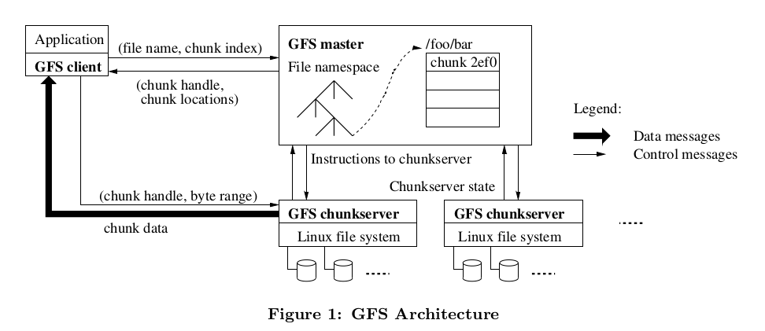
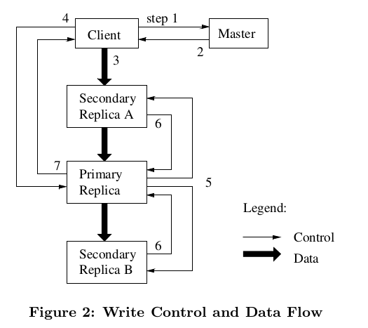

## GFS

### Introduction

设计上的不同(与传统的选择)

1. 组件故障常态的而不是异常，大量廉价的机器，机器的质量和数量导致在任何时间点都有可能有机器不可用，甚至无法从故障中恢复，因此，持续监控，错误侦测，故障容忍，自动恢复必须覆盖真个系统。
2. 文件大小巨大的，从传统角度来看。因此一些设计上的假设和参数，如 I/O 操作和块大小，需要重新审视。
3. 多数文件修改通过追加(appnding)新数据方式，而不是覆盖已经存在的数据。随机写文件几乎不存在。被写入时，文件变为只读，通常只能顺序读。这种模式下，appending 是性能优化和原子保证的关注点。
4. 提供类似文件系统的API。

### Design Overview

#### Assumptions

- 系统建立在大量廉价，普通的组件上，必须持续监控，错误侦测，故障容忍，自动恢复。
- 系统存储适当数量的大文件，预期几百万个，通常每个100MB或更大。支持小文件，但不需要着重优化。
- 主要2种读操作: 大型流读取和小型随机读。
- 系统必须有效实现良好语义的并发追加数据在同一个文件上。文件经常用于当中生产者-消费者队列或多路归并，大量客户端并发 append 一个文件。最小化同步消耗地实现原子性是关键。
- 持久稳定的带宽比低延迟重要。

#### Interface

类似文件系统的API。提供快照和 record append 操作。

快照低消耗创建文件或文件夹的副本。

record append 允许多客户端并发原子性地对同一个文件 append 数据。

#### Architecture

一个 GFS 集群包括: 一个 master 和多个 chunkserver，被多个客户端访问。

文件被分成固定大小的 chunks， 每个 chunk 有一个全局唯一不可修改的 chunk handle(64 bit)，在它被创造时有master 赋予。chunkservers 存储 chunk 在本地的磁盘当作普通的 linux 文件，读写 chunk 数据通过指定 chunk handle 和字节范围(byte range)。为了可靠性(reliability)，每个 chunk 在被赋值到多台 chunkservers 上，默认为 3个副本，用户可以为不同文件命名空间配置不同复制级别。

master 保存整个文件系统的元数据(metadata)。包括命名空间，访问控制信息，文件到 chunk 的映射，和 chunk 的位置。也负责控制这个系统的活动，如 chunk 租赁管理，孤儿 chunk 回收，chunk 迁移在不同 chunkservers 间。master 通过心跳与每个 chunkserver 下达指令和收集状态。

客户端和 master 获取操作的元数据信息，和 chunkserver 交流获取数据。

客户端和chunkserver都不会缓存文件信息，对于多数应用顺序扫描大小文件缓存重用率太低，或工作集太大很难缓存，没有缓存简化了客户端也没有缓存一致性的问题。 chunkserver 不需要缓存是因为 chunks 存储在本地文件中，linux 的 buffer cache 会缓存频繁访问的文件。

#### Single Master

Single Master 简化设计，对于全局信息的了解，可以做出更复杂放置和复制 chunk 的决策。因此，我们必须最小化 master 相关的读写，让它不会成为瓶颈。客户端读写文件数据不直接通过 master，代替询问 master 应该联系那个 chunkserver，并且限制时间内缓存这些信息，后续的操作直接联系 chunkserver。

一个简单读取操作的流程，参考 Figure 1:

1. 客户端获取文件名和 chunk index， chunk index 根据偏移量和chunk 大小(fixed)求出。
2. 客户端发送 (file name, chunk index) 到 master，master 返回(chunk handle, chunk localtions of the replicas)
3. 客户端缓存这些信息，用文件名加 chunk index 当作 key。
4. 客户端发送请求给其中一个副本，多数情况为最近一个。请求指定(chunk handle, byte range)，后续对于这个 chunk 不在需要和 master 联系，直到缓存消息过期或文件重新打开。客户端可以一次向 master 请求多个 chunk的信息，master 也可能主动把当前 chunk 后面连着的 chunk 信息回复回去，通过这些方式减少将来客户端与 master 之间的通信。

#### Chunk Size

Chunk Size 为 64 MB，懒惰的空间分配避免内存碎片导致的空间浪费，Chunk Size 大的优点:

1. 减少客户端和 master 间的通信，客户端也可以 cache 几 TB 级的大文件所有 chunk 的元信息。
2. 客户端更大可能执行更多操作在给定单个 Chunk 上，这样可以通过与 chunkserver 保持长连接减少网络负担。
3. 减少 master 存储的元数据的大小，这样让 master 可以元数据存储在内存中。

缺点：

1. 一个小文件只包含数量非常少的chunk，可能只有一个。在 chunkservers 存储的这些 chunks 可能变成热点，如果有许多客户端访问同一个文件的情况。实际上，热点不是主要问题，因为我们的应用大多都是顺序读取大型多个 chunk 的文件。
2. 热点确实发送过，一个 batch-queue system： 一个可执行文件被写在 GFS 单个 chunk，有上百个机器启动同时读取它，导致几个 chunkservers 超负荷 (overload)，通过给这个文件更高的副本因子和让机器交错启动解决。一个潜在的长期解决方案是让客户端读去其他客户端的数据在这种情况下(P2P)。

#### 2.6 Metadata

master 3中类型的 metadata:

- 文件和 chunk 的命名空间
- 文件到 chunks 的映射
- 每个chunk 的副本位置

元数据都放在 master 内存中，前 2 种类型的数据通过记录操作日志，保持在 master 的本地磁盘和复制到远程机器，来持久化。利用日志运行我们更新简单，可靠地更新 master 状态，不会因为 master 宕机导致不一致。chunk 的副本位置信息，则通过在master 启动和 chunkserver 加入集群的时候，询问 chunkserver 获得。

#####  2.6.1 In-Memory Data Structures

Master 操作是非常快的，由于元数据都在内存中。master 可以在后台扫描整个系统状态，用于实现 chunk 的垃圾回收，故障 chunkserver 上的副本的重新复制，和chunk 跨 chunkserver 的迁移以便均衡各机器负责和磁盘使用率。

chunks 数量和整个系统的容量可能受限与 master 机器的内存大小，实际这不是一个严重的限制。master 对于每个 64MB 大小的 chunk 只有少于 64 bytes 的元数据。多数的 chunks 是完整的，因为多数文件包含多个 chunks，只有文件的最后一个 chunk 可能部分填充。类似，文件命名空间的数据对于每个文件只要少于64 bytes，因为文件名使用前缀压缩。而且可以简单加内存，支持更大的文件系统。

##### 2.6.2 Chunk Locations

master 不持久化保持 Chunk Location 信息。启动轮询 chunkservers 获取，并定期通过心跳保持信息最新。

优势:

- 消除 chunkservers 加入，离开，修改名字，故障，重启等问题时，master 和 chunkservers 同步的问题。
- 只有 chunkserver 自己才对它磁盘上存在那些 chunk 有最终话语权，没有理由在 master 上维护一个一致性视图，因为 chunkserver 可能发生错误导致 chunk 莫名消失(磁盘可能失效)，或重命名了一个 chunkserver 等等。

##### 2.6.3 Operation Log

操作日志包含关键元数据变化的历史记录。它不仅持久化元数据的记录，而且被充当逻辑上的时间标准，用于定义并发操作的顺序。文件，chunk以及它们的版本，都会根据它们创建的逻辑时间被唯一的，永恒的标识。

因为操作日志是至关重要的，必须可靠地存储它，而且直到元数据更新被持久化后，才让客户端可见。否则我们失去整个文件系统或最近的操作，即使 chunkserver 没有任何问题。因此，我们复制操作日志到多台远程机器上，并且当日志记录被 flush 到本地和远程磁盘上后，才回复客户端。 master 批量 flush 多条日志，以减少 flush 和复制对整个系统的吞吐量的影响。

master 通过重复操作日志恢复文件系统的状态。为了降低启动时间，需要减少操作日志数量。master 生成存档点(checkpoints)，当日志超过某个大小时。这样通过载入磁盘上的存档点和重放有限数量的日志来恢复。存档点是一个紧凑的类 B树结构，可以直接映射到内存中，不用额外的解析。这些手段加快恢复速度和改善可用性。

因为创建存档要消耗一会时间，master 内部状态是以某种方式构建的，可以创建一个新的存档点不会延缓持续的请求。master 可以快速切换到新的日志文件，在另一个后台线程中创建存档。存档点可以短时间内被创建，即使集群有几百万个文件。完成时被写入本地和远程。

恢复只需最新完成的存档点和日志。存档发生故障，也不会影响正确性，因为恢复代码可以侦测和跳过不完整的存档点。

#### 2.7 Consistency Model

松弛(relaxed)一致性模型

##### 2.7.1 Guarantees by GFS

文件命名空间变化(如文件创建)是原子的，只有 master 可以处理这些操作：

- 命名空间锁机制保证原子性和正确性(Sections4.1)
- master 的操作日志定义了这些操作的全局顺序(Sections 2.6.3)

|      |          Write           |             Record Append              |
| :--: | :----------------------: | :------------------------------------: |
| 顺序成功 |         defined          | defined interspersed with inconsistent |
| 并行成功 | consistent but undefined | defined interspersed with inconsistent |
|  失败  |       inconsistent       |              inconsistent              |

一个文件区域修改后的状态，取决于修改类型，修改是否成功或失败，修改是否并发。上表为总结结果。

- consistent: 所有客户端从任何副本上读取到的数据是相同的，那么就是一致的(consistent)。
- defined: 一个文件数据修改后，如果它是 consistent，并且所有客户端可以看到这次修改的完整内容。
- consistent but undefined: 所有客户端看到相同的数据，但任何人的修改都没有被反应

如何区分 defined region 和 undefined region？ 数据修改分为2类：

- 应用指定偏移位置写数据。
- 记录追加(record appends)，数据被至少一次原子地追加到 GFS 选择的偏移位置(一般追加是指文件末尾的) 即使并发的修改，偏移位置会返回给客户端，而且这个位置开始的记录是 defined region。不过，文件末尾到返回的偏移量之间的区域，可能会被 GFS  插入填充部分数据或重复记录，这些区域被认为是不一致的，和用户数据数量相比这些浪费是微不足道的．这也是表格中 defined interspersed with inconsistent 的原因。

顺序成功的修改，保证 defined 和包含最后一个修改的数据：
- 应用对 chunk 的修改相同的顺序在所有的副本上(Section 3.1)。
- 用 chunk 版本号侦测副本是否过期，由于 chunkserver 挂了而错过了一些修改。

过期的副本将不会被用于修改和被 master 返回给客户端。它们被垃圾回收在最早的时机。因为客户端会缓存 chunk 的位置，它们有可能读取到过期的数据，在信息被刷新前。这个窗口受缓存的过期时间和文件下次打开(刷新这个文件相关所有的 chunk 的信息)限制。而且，多数情况文件是只被追加的，过期的副本只会返回一个提前到达 chunk 结尾，而不是返回过期数据，这样客户端会重试并联系 master，然后马上得到 chunk 位置。

组件故障也会破坏和摧毁数据。GFS 确认 chunkserver 故障的方式有，master 和 chunkserver 间的心跳握手，和通过效检和(checksum)侦测破坏数据(Section 5.2)。一旦遇到问题，将尽可能通过其他有效的副本修复数据(Section 4.3)。一个 chunk 不可挽回的丢失，只可能是在 GFS 做出反应之前所有的副本都丢失的情况。即使这种极端情况下，也是变得不可用，而不是被破坏(因为应用会接受到一个清晰的错误，而不是破坏后的数据)。

##### 2.7.2 Implications for Applications

应用可以配合 GFS 的松弛的一致性模型，已达到良好的一致性效果，比如: GFS 希望应用使用 append 而不是覆盖写，以及一些自我检查，鉴定和验证能力(relying on appends rather than overwrites,checkpointing, and writing self-validating, self-identifying records.)。一些实践经验：

- 实际上，我们所有的应用修改文件都通过 appending 而不会覆盖。Appending 是更加有效和灵活的对于应用故障，比随机覆盖写。
- 原子重命名一个已经写完所有数据的文件。
- 定期 checkpoints 有多数数据已经被成功写入，checkpoints 可能也包含应用层的 checksum，读取着可以只检验(verify) 和处理文件最后一个 checkpoint 之前的区域，这些区域是 defined 状态的。checkpointing 允许 writers 增量地重启，和让 readers 一直处理已经成功写入的从应用视角看不完整的文件数据
- record append 的语义是至少一次，也就是发生错误时会重试，这样导致填充部分数据或重复记录，对于不完整的数据，GFS 提供 checksum 用与检验数据可用性，对于重复记录，应用不可容忍的话(如果操作是非幂等的)，可以通过为每个记录分配唯一的ID，来过滤数据。

GFS 提供上述解决方案的共享代码库(除了重复记录过滤)。

### 3 System Interactions

我们设计架构以最小化所有操作对 master 的依赖。在这种背景下，说明 client，master， chunkservers 之间的如何交互，来实现数据修改，原子记录追加，快照等。

#### 3.1 Leases and Mutation Order

mutation 是一种操作，修改一个 chunk 上的内容或元数据，如写或追加操作。每次 mutation 都被执行在所有的 chunk 副本上。我们利用租约(leases)保证夸副本的一致性的变异(mutation)顺序。master 选择一个副本授予租约，称为首要(Primary)副本，首要副本确定一个chunk的所有变异的顺序，所有的副本按照这个顺序应用变异。

租约初始过期时间为 60s。然而，如果 chunk一直在变异，首要副本可以向 master 申请连任。master 和所有 chunkservers 心跳信息会附带请求连任和授予租约消息。master 有时也可能收回租约(如文件正在重命名时，master 想取消所有的变异)。即使master与首要副本失去联系，也可以安全地授予新的租约给其他副本在旧的租约过期后。

具体的控制流程（Figure 2）：

1. 客户端询问 master 那个 chunkserver 拥有 chunk 的租约和其他副本的位置，如果没有 chunkserver 有，master 选择一个授予。
2. master 回复首要副本，和其他副本的位置信息。客户端缓存这些数据为将来的变异，当首要副本不可达或回复不在拥有租约时，客户端才会再次联系 master。
3. 客户端可以以任意顺序推送数据给所有副本。每个 chunkserver将存储这些数据在内部的 LRU 缓存中，直到数据被使用或过期。通过解耦数据流和控制流，我们可以改进性能，实现基于网络拓扑的算法来调度昂贵的数据流，无需关心主要副本还是次要副本(Secstion 3.2 讨论算法的细节)
4. 一旦所有副本都确认接收到数据后，客户端发送一个写请求给首要副本。写请求包含数据的标识符(第3步推送的)。首要副本给来自多个客户端的每个变异确定连续的序号，然后按照这个顺序应用在本地状态上。
5. 首要副本转发写请求给次要副本，次要副本按照首要副本确定的顺序应用变异。
6. 所有次要副本回复首要副本，确认它们已完成操作。
7. 首要副本回复客户端。在任意副本上发生的任何错误，都会被报告给客户端。错误发生的情况，写操作已经在首要或某些次要副本实施成功。客户端请求被认为失败，修改的区域处于不一致状态。我们的客户端代码通过重试变异处理这种错误，将先尝试 (3) 至 (7) 步骤，如果不行重试全部步骤。

如果应用的写请求很大，跨越了 chunk 边界，GFS 客户端代码会将其拆成多个写操作。各个操作都按照上述控制流，但是可被来自其他客户端的并发写操作交错(be interleaved with)和覆盖。因此共享区域可能最后包含来自不同客户端的数据碎片(fragments)。尽管副本都是相同的，因为每个客户端的操作(可能有多次写请求)都是按照相同顺序成功写入所有副本的。这就使文件处于一致但未定义状态(consisten but defined) 2.7 节所说的。

#### 3.2 Data Flow

数据流算法：
1. 为完全地利用机器的网络带宽，数据线性地沿着一条链式 chunkservers 推送数据，而不会切分为多个接受者。
2. 为尽可能避免网络瓶颈和高延迟链路，每台机器转发数据给"最近的"的还没有接受数据的机器。假设客户端推送数据给[S1, S2, S3, S4]，流程为: client -> closest(S1, S2, S3, S4) = S1 -> closest(S2, S3, S4) = S2 -> closest(S3, S4) = S3 -> S4 。我们的网络拓扑结构是简单的，可以用IP 地址精确预估出"距离"。
3. 为最小化延迟，使用 TCP 流式传输数据。chunserver 接收到数据，马上开始转发。流式传输对于我们是特别有用的，因为我们使用switched network with full-duplex(全双工) links。立即发送数据不会影响数据的接受(TCP 全双工的原因)。没有网络拥堵情况下，B bytes 数据传输给 R 给副本时间为: B/T + RL，T 是网络吞吐量，L是两台机器间的延迟。

#### 3.3 Atomic Record Appends

3.1 节的最后和 2.7.1 节都说明，传统指定位置写数据，在并发情况下是 consistent with undefined，需要客户端自己做同步保证。而 record append 保证至少一次的原子性写入在 GFS 指定的位置，类似 UNIX 对于文件 O_APPEND 模式下写数据，并发情况下也没有竞态条件。

Record Append 遵循 3.1 节的控制流程，只需一点额外的逻辑在首要副本上。首要副本接受到写请求(第4步)是会检查追加的数据是否会超过当前 chunk 的最大容量(64M)，如果超过了，它填补数据到 chunk 的最大容量，通知其他次要副本做相同的操作，然后让客户端重试在新的 chunk 上(record append 数据大小被限制小于等于 chunk maxsize 的四分之一，避免填补导致过多的碎片)，没有超过情况时，首要副本 append 数据到它本地副本，得到偏移量，然后告诉次要副本写入到这个偏移量，最终回复客户端成功。

Record Append 失败话，客户端重试操作。这会导致相同的 chunk 各个副本上包含不同的数据(全部或部分重复的记录)。GFS 不保证所有副本字节上相同。它仅仅保证 record append 能原子执行，写入至少一次，保证 record append 成功后，所有副本写入的有效偏移量相同，并且写入的区域是 defined的。对于写入失败的区域是不一致的(undefined)，应用是可以处理的(2.7.2 说明了)。

#### 3.5 Snapshot

快照操作可以即时地对一个文件或目录树执行一个拷贝，期间对新的变异请求影响也很小。用处有快速创建大型数据集拷贝分支，存档(checkpoint)当前状态，做一些实验性的改变，以便随后提交或回滚。

快照使用 copy-on-write 技术实现。实现步骤：
1. master 接受快照请求后，收回所有快照相关文件的chunk的租约。确保后续的写操作都会和 master 交互获取谁持有租约，来确保master 有机会先创建一个 chunk 的拷贝。
2. master 写操作日志到磁盘。应用日志记录复制目标文件或目录树的元数据在内存状态中，复制的元数据映射在相同的 chunk (类似应用计数)。
3. 假设一个客户端想写 chunk C 在快照操作后，当客户端请求 master 获取谁拥有租约时，master 发现 chunk 
   C 的引用大于1时，它推迟回复客户端，然后选择一个性的 chunk 句柄 C' ，然后要求所有包含 C 副本的 chunkserver 为 C‘ 创建一个副本，创建新 C' 副本只需拷贝本地的副本。master 确认创建好 C' 副本后，最后回复客户端，后续执行正常的写入操作。

### 4 Master  Operation

#### 4.1 Namespace Management and Locking

允许多个操作并发，和提供命名空间的区域锁机制，保证合适的串行。

GFS 不支持目录记录文件列表的数据结构，也不支持文件和目录别名。GFS 的命名空间逻辑上可以理解为一个 lookup table，包含完整路径名到元数据的映射。并且利用前缀压缩提高效率。命名空间树的每个节点都有一个对应的读写锁。

每个 master 操作都需要获取一系列的读写锁。通过一个例子解释锁机制：比如当 /home/user/ 目录正被快照到 /save/user 时，我们能利用锁机制防止用户创建一个 /home/user/foo 的新文件。首先快照操作获取了 /home 和 /save 的读锁，/home/user 和 /svae/user 写锁。创建新文件请求申请 /home 和 /home/user 的读锁，/home/user/foo 上的写锁，由于 /home/user 上的冲突，那么快照和创建新文件操作会串行执行。

由于 GFS 目录功能简单，不支持文件列表，没有类似文件系统的 inode 信息需要维护，所有创建、删除文件不会修改上级目录的数据结构，故写文件是也不需要申请上级目录的写锁，只需读锁即可。

通过命名空间锁可以允许相同目录并发发生变化。因为上级目录只需要读锁即可，各自文件的写锁也不冲突。目录的读锁可以阻止目录被删除，重命名或快照。相同文件创建的写锁，也只会导致文件被串行创建２次。

因为命名空间节点非常多，读写锁对象为 layz 分配，用完即删除。为了防止死锁，锁需按顺序申请：首先按命名空间树的层级排序，然后相同层级按字典序。

#### 4.2 Replica Placement

GFS 集群是高度分布式的，而且有多个层级(机房 / 机架 / 服务器)。chunk 副本布置的策略主要遵循两个目标：最大化数据可靠性和可用性，最大化网络带宽利用。必须跨机架放置冗余 chunk 副本，以保证整个机架损坏下架系统仍可用。也可以按机架的带宽来分摊读操作流量。不过会导致写流量被发往多个机架，不过这个代价是可以接受的。

#### 4.3 Creation, Re-replication, Rebalancing

master 创建一个 chunk，选择放置初始空的副本考虑的因素：

1. 放置在低于平均磁盘利用率的 chunkserver 上，以便均衡磁盘利用率。
2. 限制某台 chunkserver 最近短时间内创建的副本数量。创建本身是廉价，但预示着即将来临的写流量，据我们观察也预示着紧随其后的大量读流量。
3. 希望跨机架创建 chunk 副本。

master 重新复制 chunk 副本，当副本数量小于用户指定的数量时。有很多原因导致副本数量不足：如某个 chunkserver 不可用了，某个副本可能被破坏，磁盘变为不可用，用户提高复制级别。每个 chunk 副本重新复制按照优先级，优先级因素有：1.  chunk 低于复制标准的程度。2. 降低已被删除和曾经被删除文件对应的 chunk 的优先级。3. 提高可能阻塞客户端进程的 chunk 的优先级。

master 选择最高优先级的 chunk 执行重新复制，只需指令某些 chunkserver 直接从一个已知存在的合法副本上拷贝数据并创建新的副本。这里选择那些 chunkserver 也需按照上面说的 chunk 放置策略来选择。re-replication 会导致整个 chunk 数据在网络上传输多次，为了减小影响， master 会限制整个集群以及每台 chunkserver 上同时执行 re-replication 的数量，短时间内不会执行大量的 re- replication。 每个 chunkserver 在拷贝源 chunkserver 的副本时也会采用限流避免占用过多的网络带宽。

master 定期 再平衡副本负载(rebalance replicas)。master 检查当前副本的分布情况，为更加均衡磁盘空间利用率和负载，对必要的副本执行迁移，迁移也考虑上述说3个因素，更喜欢迁移到低于平均磁盘利用率的 chunkserver 上。新的 chunkserver 加入集群时也是通过这个活动来慢慢填充，而不是立即让他接受大量写流量。

#### 4.4 Garbage Collection

文件被删除后，GFS 不会立即回收物理存储。通过懒惰的基于文件和chunk水平的垃圾回收(GC)。这种方式使系统更加简单和可靠。

##### 4.4.1 Mechaism

当文件被删除时，master 立即记录删除日志像其他改变一样。然而，代替立即回收资源，文件被重命名到一个隐藏的文件名包含删除时间戳。master 扫描文件系统的命名空间时，会移除那些超过3天的隐藏文件(时间可配置)。在哪之前，文件任然可以被读取用新的、特殊的名字，和可以恢复删除文件通过重命名回到正常的名字。当隐藏文件也被删除了，那么它在内存中的元数据也被删除，高效地切断它到自己所有 chunk 的引用。

在相似的命名空间的扫描中， master 识别孤儿 chunk (没有任何文件引用的 chunk)，并删除它们的元数据。在心跳消息中， 每个 chunkserver 会汇报它们拥有的 chunks 的一个子集，master 会回复那些 chunk 已经不在 master 的元数据中。chunkserver 自由删除这些 chunk 的副本。

##### 4.4.2 Discussion

分布式垃圾回收是一个困难的问题，但我们的做法却很简单。 master 记录文件到 chunk 映射，可以轻易识别所有 chunk 副本在那台 chunkserver 的linux 文件目录下。任何无法被 master 识别的副本都当作"垃圾"。

我们垃圾回收方案优势:

1. 是简单且可靠的在组件故障常见的大型分布式系统上。chunk 创建可能在一些 chunkserver 上成功，其他的失败，丢弃那些 master 不知道的副本。副本删除消息也可能丢失，而且 master 必须记录重发消息当遇到错误在它和 chunkserver 之间时。垃圾回收提供统一可靠的方式清理任意副本不被引用的副本。
2. 合并了垃圾回收的逻辑到 master 的各种例行的后台活动中，如命名空间扫描，心跳消息等。所有它一般都是批量处理，消耗陪均摊了，而且只在 master 相对空闲的时候处理。可以迅速回复客户端那些需即使关注的请求。
3. 延迟回收有时可以挽救偶然的不可逆的删除(不可逆)。

延迟回收的弊端，当大量重复创建和删除临时文件是，会产生大量不能被即时回收的垃圾。针对这种情况，我们通过判断一个文件是否被再次删除来加快资源回收。类似复制级别，不同命名空间区域可配置各自的回收策略。

#### 4.5 Stale Replica Detection

由于 chunkserver 故障，导致错失变异，chunk 可能是旧版本。每个 chunk，master 保持一个版本号码用于区分最新和旧的副本。

当 master 授予一个 chunk 租约时，会增加 chunk 的版本号，并通知最新的副本。master 和这些副本记录版本号在它们的持久化状态中。这些都发生在 chunk 写操作之前。如果一个副本当前是不可用，那么他的版本就不会被更新。master 可以侦测到 chunkserver 有旧的副本，因为 chunkserver 重启是会汇报它的 chunk及其版本号信息。如果 master 看到一个它更高的版本的记录， master 会认为自己在授予租约时发生了故障，继而认为更高的版本才是最新的。

master 移除旧的副本通过垃圾回收。在那之前，master 把旧的副本当作根本不存在，当客户端请求 chunk 信息时。另一安全保证是，master 在通知客户端那个 chunkserver 持有 chunk 的租约或指令 chunkserver 做克隆操作时，都带有 chunk 的版本号。 客户端或 chunkserver 执行操作时都会确认版本号，以便总是获取最新的数据。

### 5 Fault tolerance and diagnosis

最大挑战是频繁的组件故障。而且由于组件的质量和数量，使这些问题很普遍。如何面对这些挑战，以及我们构建的帮助诊断的工具。

#### 5.1 High Availability

我们保持整个系统的高可用，用两个有效的策略: 快速恢复(fast recovery) 和复制(replication)

##### 5.1.1 Fast Recovery

master 和 chunkserver 都可以在几秒内重启并恢复它们的状态无论如何被终止的。恢复时间非常短，甚至只会影响到那些正在执行中未能回复的请求，客户端很快就可以重连到已经恢复的服务器。

##### 5.1.2 Chunk Replication

如前面讨论一样，每个 chunk被复制在多个 chunkserver上位于不同机架。用户可以指定不同复制级别对文件命名空间的不同部分。默认为3。

##### 5.1.3 Master Replication

master 状态被复制为了可靠性。操作日志和存档点被复制在多台机器。一个状态的变异被提交，只在它的日志被刷新到本地和其他 master 副本的磁盘。当 master 故障时，它可以马上完成重启。如果它的机器或磁盘故障，GFS 系统外的监控设施会在另一台冗余的机器上启动新的 master 进程。客户端通用 canonical name 访问 master的，通过修改 DNS 别名重定向到新的机器。

此外提供 shadow master，在 master 宕机后提供只读服务。它一般落后主 master 一秒左右。如果文件不是正在发送变异，或者应用不介意使用旧的结果，提高读可用性。事实上，因为文件内容是从 chunkserver 上读取，应用不会看到旧的文件内容。看到只是旧的文件元数据而已，如目录内容或访问控制信息。

shadow master 会持续读取某个 master 副本的操作日志，重放到自己的内存中数据结构。和主master 一样，它拉去 chunkserver 中 chunk 的位置信息再启动时，通过心跳信息监控 chunkservers 的状态。

#### 5.2 Data Integrity

每个 chunkserver 使用 checksum 来侦测腐化的数据。我们可以利用其他正常的 chunk 副本恢复腐化数据，但是通过跨 chunkserver 对比副本之间的数据来侦测腐化是不切实际的。而且，各个副本内的字节数据出现差异也是合法的(前文 3.3节中 原子的 record append就可能导致这种情况)。因此每个 chunkserver 需要通过维护 chunksums 来效验数据完整性。

一个 chunk 被分为 64KB 块，每块对应 32bit 的 chunksum。chunksums 保存在日志并用日志持久化，和用户数据分离。

在客户端或其他 chunkserver 读取时，返回数据前，chunkserver 会效验读取范围内的数据块的 chunksum。因此 chunkservers 不会传播腐化的数据给其他机器。如果块不匹配 chunksum，chunkserver 返回错误给请求者和报告给 master。请求者将重试读取其他的副本，master 将克隆 chunk 从其他副本，新的副本有效后，master 指令 chunkserver 删除匹配错误的副本。

checksum 对读性能影响不大。因为大部分读只会跨越几个块，效验的计算量相对较小。GFS 客户端代码在读操作中尽量避免跨越块边界， 减少 checksum 的负担。而且 checksum 的查找和比较不需要任何 I/O 的，checksum 计算通常在 I/O 等待期间完成。

checksum 的计算是为 append 操作做了高度优化的， 因为 append 是我们的主要应用场景。checksum 计算是可以增量更新的，即使当前的块未填充满也可以计算部分的checksum 用于以后更新。即： ` checksum(0, "abc") = checksum(checksum(0, "ab"), "c")` 。即使追加的那块原先已经腐化而append是没有检测到，增量更新后的 checksum，也会匹配失败。

普通写操作比 append 复杂，它会覆盖文件的某个区域，写之前需要先检测区域内首尾的两个块的 checksum，因为这两块可能只覆盖部分，且无法进行增量的更新，只能重新计算整个块的 checksum，覆盖老的 checksum，如果它们原先是腐化的，不先检查的话，覆盖后就无法识别了。

系统空闲时，chunkserver 会去扫描和检查不太活跃的 chunk。 这样那些很少被读取的 chunk 也能被侦测到。一旦发生腐化，GFS 可以即时创建新的副本，删除腐化的副本。这种方式可以避免，chunk 不活跃而欺骗了 master 以为 chunk 的有足够有效副本。
