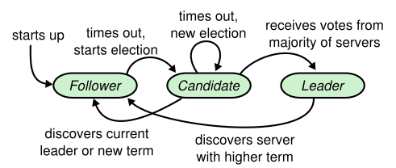

## Raft

### 1 Introduction

一致性算法，让一群的机器像一个整体一样工作，即使有些成员发生故障，任然可以正常工作。因此，它是构建大型可靠的软件的关键角色。Paxos 过去10年主要一致性算法，多数一致性实现基于 Paxos 或受它影响。

不幸是，Paxos 是一个非常难理解的算法。和 Paxos 痛苦挣扎后，我们开始设计一个新的一致性算法，提供更好的系统构建和教育基础。我们的目标是可理解性：是否可以在实际系统定义一致性算法，并且可以比 Paxos 更简单的方式学习。此外，我们希望该算法方便系统构建者的直觉的发展，算法可以工作很重要，能够显而易见知道算法为什么这么工作也很重要。

Raft 通过分解(分成领导选举，日志复制和安全性) 和减少状态机的状态。它的几个不同于别的一致性算法的独特特性：

- 强领导者
- 领导选举：Raft 使用随机时间计数器选举领导。
- 成员关系改变

## 2 Replicated state machines

一致性算法实在复制状态机的背景下提出的。在一致性算法下，一组服务器的状态机产生同样的状态副本因此即使有些服务器崩溃了这一组服务器还能很好的继续运行。复制状态机在分布式系统被用于解决许多有关错误容忍问题(fault tolerance problems)。

复制状态机是通过复制日志来实现的。状机顺序执行日志中的命令，每台计算机状态机是从同一个 state 出发，执行相同的命令，那么最后相同的  state 也就一样。

一致性算法工作就是保证复制日志一致。在一台服务器上，一致性模块接收客户端的命令，添加到它的日志中，它和其他服务器上的一致性模块通信确保每个日志最终保证相同的请求序列，即使一些服务故障了。一旦日志被正确复制，每台服务器上的状态机按照日志顺序处理，然后把输出结果返回客户端。结果上看，服务器像一台可靠的状态机。

实际系统中一致性算法有下列属性：

- 确保安全性在所有非拜占庭（non-Byzantine）条件下，包括网络延迟，分区，丢包，冗余和乱序的情况下。
- 高可用性（available），只要大部分机器是运行的，可以互相通信且可以和客户端通信，那么集群就是可用的。
- 不依赖时序保证日志一致。时钟错误和极端情况下的消息延迟，在最坏的情况下才会引起可用性问题。
- 多数情况下，一条命令只要在集群的多数节点响应一轮的远程调用就可以完成。少数缓慢的服务器，不会影响整个系统的性能。

## 3 What's wrong with Paxos?

1. 太难以理解。
2. 太难在实际环境中实现。

## 4 Design for understandability

Raft 设计目标：

- 提供一个完整的，实际的构建系统的基础，减少开发者的工作量。
- 安全的在所有条件下，且可用的在多数情况下
- 多数操作是高效的
- 最重要是，易于理解的，多数人可以轻松理解
- 它必须能让开发者有一个直观的认识，这样才能是系统构建者去对它进行拓展

## 5 The Raft consensus algorithm

Raft 通过选举一个特别的领导者，让领导者完全负责管理日志复制来实现一致性。领导者接受客户端的日志项，复制它们到其他服务器，然后告诉服务器何时在状态机上应用日志项是安全的。有一个领导人极大简化了对复制日志的管理。例如，领导人可以决定新的日志条目需要放在日志中的什么位置而不需要和其他服务器商议，领导人可以故障或与其他服务器失联，这种情况会选举出新的领导人。

通过领导人选举的方式，Raft 把一致性问题分解 3 个相关且独立的子问题：

1. 领导人选举
2. 日志复制
3. 安全性，在 Raft 中安全性的关键是状态机的安全性。

### 5.1 Raft basics

一个 Raft 集群包含几台服务器，5 台服务器情况下，可以允许 2 台发生故障。任何时刻每台服务都处于 3 种状态之一: 领导者（leader)，追随者（follower），候选者（candidate）。正常情况下，有一个领导者和其他服务器都为追随者。追随者是消极的，它不发出任何请求，只简单响应领导者和候选者的请求。 候选者状态用于选举新的领导者。Figure 4 展示这些状态的转换。

> Figure 4：服务器的状态。追随者响应其他服务器的请求。如果追随者没有收到任何消息，它会变为候选者并且开始一次选举。收到多数服务器的投票的候选人变为领导者。领导者会在它宕机之前，一直保持领导者状态。

> Figure 5：时间被分成连续的任期（term）。每个任期以一个选举开始。选举成功后，一个领导者管理真个集群直到任期结束。选举失败时，任期就以没有领导人结束。任期间转变可能在不同时间不同服务器上被观察到。

如 Figure 5 所示，Raft 将时间划分为任意长度的任期（term）。用连续的数字表示。每个任期以一个选举开始，一个或多个候选者尝试变为领导者，如果候选者赢得选举，它就当做领导者在任期的剩余时间内。一些情况下，选票被平方，那么任期就直接以没有领导人而结束。一个新的任期将立即开始。Raft 确保一个任期内至多只有一个领导者。

不同的服务器可能观察到任期间的转换在不同的时间，而且有些情况下服务器可能观察不到一个选举或整个任期。任期扮演逻辑时钟角色在 Raft，它们让服务检测过期的信息如过时的领导人。每个服务存储一个当前任期号，它单调递增随时间。当前任期被交换在服务间通信时。如果一个服务当前任期号小于其他服务的，那么更新到更大的值。如果领导者和候选者发现自己任期是过时的，那么它会立即变为跟随者状态。如果接受一个带有过期任期号的请求，拒绝这个请求。

Raft 服务使用 RPC 进行通信，基础的一致性算法只需要 2 个类型的 RPC 调用。RequestVote RPCs，被候选者选举期间调用，AppendEntries RPCs，领导者复制日志项和提供一种心态机制。第7节添加一种 RPC 用于服务器之间传输快照。如果服务器没有及时响应 RPC，它们会重试，并且它们会并行发起请求为了性能。

### 5.2 Leader election

Raft 利用心跳机制触发领导人选举。当服务启动时，初始为跟随者。一个服务保持在跟随者状态只要它接受到有效的来自领导者或候选者的 RPCs。领导者定期发送心跳(AppendEntries RPCs 不带日志项) 给所有跟随者，来维持它们的领导人位置。如果一个跟随者一段时间内没有收到心跳消息，也就是选举超时，它就假定系统没有可用的领导者，然后开始发起新领导人选举。

开始一个选举，跟随者增加它的任期号并且转换为候选者状态。然后它给自己投票然后并行发起 RequestVote RPCs 给集群的其他服务。一个候选者继续它的状态直到发生下列 3 件事之一：

- 赢得选举。
- 其他服务成为领导者。
- 一段时间后没有胜利者。

一个候选者赢得选举，如果它收到整个集群多数服务的票数，在同一任期内。每个服务最多对一个任期号投出一张选票，按照先来先服务原则（5.4 节增加一个额外的限制）。多数选票原则保证一个特定任期内最多一个候选人可以赢得选举。一旦一个候选人赢得选举变为领导人。它发送心跳消息给其他所有的服务维持领导人位置，并阻止新的选举。

选举期间，一个候选者可能收到来自其他服务声明它是领导人的 AppendEntries RPC。如果这个领导人的任期号大于等于候选人的任期号，那么候选者则认为这个领导者是合法的，然后回到合法状态。如果小于候选人的任期号，候选人拒绝这个这次RPC 并且继续保持候选人状态。

第三种情况，结果是候选人既没有赢得选举也没有输：如果跟随者同时变为候选人，选票可能被瓜分，以至于没有候选人获得多数票。这种情况发生时，候选人将超时，然后增加任期号开始一个新的选举，发起另一轮的 RequestVote RPCs。然而，没有其他机制的话，选票可能被无限地重复瓜分。

Raft 使用随机的选举超时时间，保证平分选票是稀少的，并且可以快速解决。为阻止一开始选票就被瓜分，选举超时时间被在一个固定范围（150-300ms）内随机选择。这样可以分散服务，以便多数情况下只有一个服务超时。它赢得选举，并发送心跳在其他服务超时前。同样的机制被用作发生瓜分选票的情况下，每个候选者重置一个随机的选举超时时间在选举开始时，并且等待的超时时间结束在开始下一次选举之前。这样减少在新的选举，发生另一次瓜分选票的情况。

### 5.3 Log replication

