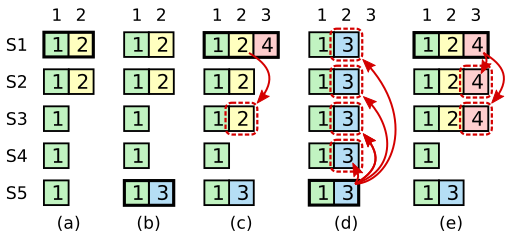

## Raft

### 1 Introduction

一致性算法，让一群的机器像一个整体一样工作，即使有些成员发生故障，任然可以正常工作。因此，它是构建大型可靠的软件的关键角色。Paxos 过去10年主要一致性算法，多数一致性实现基于 Paxos 或受它影响。

不幸是，Paxos 是一个非常难理解的算法。和 Paxos 痛苦挣扎后，我们开始设计一个新的一致性算法，提供更好的系统构建和教育基础。我们的目标是可理解性：是否可以在实际系统定义一致性算法，并且可以比 Paxos 更简单的方式学习。此外，我们希望该算法方便系统构建者的直觉的发展，算法可以工作很重要，能够显而易见知道算法为什么这么工作也很重要。

Raft 通过分解(分成领导选举，日志复制和安全性) 和减少状态机的状态。它的几个不同于别的一致性算法的独特特性：

- 强领导者
- 领导选举：Raft 使用随机时间计数器选举领导。
- 成员关系改变

## 2 Replicated state machines

一致性算法实在复制状态机的背景下提出的。在一致性算法下，一组服务器的状态机产生同样的状态副本因此即使有些服务器崩溃了这一组服务器还能很好的继续运行。复制状态机在分布式系统被用于解决许多有关错误容忍问题(fault tolerance problems)。

> Figure 1：复制状态机的架构。一致性算法管理来自客户端状态命令的复制日志。状态机处理的日志中的命令的顺序都是一致的，因此会得到相同的执行结果。

复制状态机是通过复制日志来实现的。状机顺序执行日志中的命令，每台计算机状态机是从同一个 state 出发，执行相同的命令，那么最后相同的  state 也就一样。

一致性算法工作就是保证复制日志一致。在一台服务器上，一致性模块接收客户端的命令，添加到它的日志中，它和其他服务器上的一致性模块通信确保每个日志最终保证相同的请求序列，即使一些服务故障了。一旦日志被正确复制，每台服务器上的状态机按照日志顺序处理，然后把输出结果返回客户端。结果上看，服务器像一台可靠的状态机。

实际系统中一致性算法有下列属性：

- 确保安全性在所有非拜占庭（non-Byzantine）条件下，包括网络延迟，分区，丢包，冗余和乱序的情况下。
- 高可用性（available），只要大部分机器是运行的，可以互相通信且可以和客户端通信，那么集群就是可用的。
- 不依赖时序保证日志一致。时钟错误和极端情况下的消息延迟，在最坏的情况下才会引起可用性问题。
- 多数情况下，一条命令只要在集群的多数节点响应一轮的远程调用就可以完成。少数缓慢的服务器，不会影响整个系统的性能。

## 3 What's wrong with Paxos?

1. 太难以理解。
2. 太难在实际环境中实现。

## 4 Design for understandability

Raft 设计目标：

- 提供一个完整的，实际的构建系统的基础，减少开发者的工作量。
- 安全的在所有条件下，且可用的在多数情况下
- 多数操作是高效的
- 最重要是，易于理解的，多数人可以轻松理解
- 它必须能让开发者有一个直观的认识，这样才能是系统构建者去对它进行拓展

## 5 The Raft consensus algorithm

Raft 通过选举一个特别的领导者，让领导者完全负责管理日志复制来实现一致性。领导者接受客户端的日志项，复制它们到其他服务器，然后告诉服务器何时在状态机上应用日志项是安全的。有一个领导人极大简化了对复制日志的管理。例如，领导人可以决定新的日志条目需要放在日志中的什么位置而不需要和其他服务器商议，领导人可以故障或与其他服务器失联，这种情况会选举出新的领导人。

通过领导人选举的方式，Raft 把一致性问题分解 3 个相关且独立的子问题：

1. 领导人选举
2. 日志复制
3. 安全性，在 Raft 中安全性的关键是状态机的安全性。

| 特性       | 解释                                       |
| -------- | ---------------------------------------- |
| 选举安全原则   | 一个任期内最多一个领导者被选举出，5.2节。                   |
| 领导人只附加原则 | 领导人绝不会覆盖或删除日志中条目，只追加新条目。5.3节             |
| 日志匹配原则   | 如果两个日志包含相同索引位置和任期号的条目，那么日志从这个条目索引位置之前的所有的条目也相同。5.3 节 |
| 领导者完全原则  | 如果一个日志条目在某个任期被提交了，那么这个条目将出现在所有更高任期号的领导人日志 |
| 状态机安全原则  | 如果一个服务器状态机执行了给定日志索引位置的条目，那么其他服务器不会在相同索引位置上执行不同的日志条目。 |

> Figure 3： Raft 算法保证任何时刻这些属性都是成立的。

### 5.1 Raft basics

一个 Raft 集群包含几台服务器，5 台服务器情况下，可以允许 2 台发生故障。任何时刻每台服务都处于 3 种状态之一: 领导者（leader)，追随者（follower），候选者（candidate）。正常情况下，有一个领导者和其他服务器都为追随者。追随者是消极的，它不发出任何请求，只简单响应领导者和候选者的请求。 候选者状态用于选举新的领导者。Figure 4 展示这些状态的转换。

> Figure 4：服务器的状态。追随者响应其他服务器的请求。如果追随者没有收到任何消息，它会变为候选者并且开始一次选举。收到多数服务器的投票的候选人变为领导者。领导者会在它宕机之前，一直保持领导者状态。

> Figure 5：时间被分成连续的任期（term）。每个任期以一个选举开始。选举成功后，一个领导者管理真个集群直到任期结束。选举失败时，任期就以没有领导人结束。任期间转变可能在不同时间不同服务器上被观察到。

如 Figure 5 所示，Raft 将时间划分为任意长度的任期（term）。用连续的数字表示。每个任期以一个选举开始，一个或多个候选者尝试变为领导者，如果候选者赢得选举，它就当做领导者在任期的剩余时间内。一些情况下，选票被平方，那么任期就直接以没有领导人而结束。一个新的任期将立即开始。Raft 确保一个任期内至多只有一个领导者。

不同的服务器可能观察到任期间的转换在不同的时间，而且有些情况下服务器可能观察不到一个选举或整个任期。任期扮演逻辑时钟角色在 Raft，它们让服务检测过期的信息如过时的领导人。每个服务存储一个当前任期号，它单调递增随时间。当前任期被交换在服务间通信时。如果一个服务当前任期号小于其他服务的，那么更新到更大的值。如果领导者和候选者发现自己任期是过时的，那么它会立即变为跟随者状态。如果接受一个带有过期任期号的请求，拒绝这个请求。

Raft 服务使用 RPC 进行通信，基础的一致性算法只需要 2 个类型的 RPC 调用。RequestVote RPCs，被候选者选举期间调用，AppendEntries RPCs，领导者复制日志项和提供一种心态机制。第7节添加一种 RPC 用于服务器之间传输快照。如果服务器没有及时响应 RPC，它们会重试，并且它们会并行发起请求为了性能。

### 5.2 Leader election

Raft 利用心跳机制触发领导人选举。当服务启动时，初始为跟随者。一个服务保持在跟随者状态只要它接受到有效的来自领导者或候选者的 RPCs。领导者定期发送心跳(AppendEntries RPCs 不带日志项) 给所有跟随者，来维持它们的领导人位置。如果一个跟随者一段时间内没有收到心跳消息，也就是选举超时，它就假定系统没有可用的领导者，然后开始发起新领导人选举。

开始一个选举，跟随者增加它的任期号并且转换为候选者状态。然后它给自己投票然后并行发起 RequestVote RPCs 给集群的其他服务。一个候选者继续它的状态直到发生下列 3 件事之一：

- 赢得选举。
- 其他服务成为领导者。
- 一段时间后没有胜利者。

一个候选者赢得选举，如果它收到整个集群多数服务的票数，在同一任期内。每个服务最多对一个任期号投出一张选票，按照先来先服务原则（5.4 节增加一个额外的限制）。多数选票原则保证一个特定任期内最多一个候选人可以赢得选举。一旦一个候选人赢得选举变为领导人。它发送心跳消息给其他所有的服务维持领导人位置，并阻止新的选举。

选举期间，一个候选者可能收到来自其他服务声明它是领导人的 AppendEntries RPC。如果这个领导人的任期号大于等于候选人的任期号，那么候选者则认为这个领导者是合法的，然后回到合法状态。如果小于候选人的任期号，候选人拒绝这个这次RPC 并且继续保持候选人状态。

第三种情况，结果是候选人既没有赢得选举也没有输：如果跟随者同时变为候选人，选票可能被瓜分，以至于没有候选人获得多数票。这种情况发生时，候选人将超时，然后增加任期号开始一个新的选举，发起另一轮的 RequestVote RPCs。然而，没有其他机制的话，选票可能被无限地重复瓜分。

Raft 使用随机的选举超时时间，保证平分选票是稀少的，并且可以快速解决。为阻止一开始选票就被瓜分，选举超时时间被在一个固定范围（150-300ms）内随机选择。这样可以分散服务，以便多数情况下只有一个服务超时。它赢得选举，并发送心跳在其他服务超时前。同样的机制被用作发生瓜分选票的情况下，每个候选者重置一个随机的选举超时时间在选举开始时，并且等待的超时时间结束在开始下一次选举之前。这样减少在新的选举，发生另一次瓜分选票的情况。

### 5.3 Log replication

一旦领导者被选举出来，它就开始给客户端提供服务。每个客户端请求的命令被复制状态就执行。领导者把命令作为新的日志条目追加到它的日志中去，然后并行发起 AppendEntries RPCs 给其他所有的服务，用于复制这条条目。当条目被安全地复制（后面描述），领导者让状态机执行这条条目，把执行结果返回给客户端。如果跟随者崩溃或运行缓慢，或如果网络丢包了，领导者都会一直重试 AppendEntries RPCs（即使已经响应了客户端）直到所有的跟随者最终都存储了所有的日志条目。

> Figure 6：日志由有序编号的日志条目组成。 每个日志条目包含它被创建时的任期号（方块中的数字），并且包含用于状态机执行的命令。如果一个条目能够被状态机安全执行，就被认为可以提交了。

日志组成如 Figure 6。每条日志条目存储状态机的命令和被接受时领导人的任期号。日志条目中的任期号用于检测日志间的不一致，和保证一些 Figure 3 的属性。还一个整数索引表示他在日志中的位置。

领导者决定何时将日志条目在状态机上执行是安全的。这样条目被称为已提交（commited）。Raft 保证已提交的日志条目是持久化的，且最终被所有有效的状态机执行。一旦领导者创建的日志条目被复制到多数服务上，日志条目会被提交（如 Figure 6 中的条目7）。领导者日志中之前的日志条目也都是提交的，包括之前领导者创建的。领导者追踪记录他知道最大的已提交的索引，并且把这个索引包含在将来的 AppendEntries RPCs（包括心跳）中，以便于其它服务器知道领导者提交的位置。一旦跟随者知道一条日志条目已被提交，就会在本地状态机上执行条目（按照日志顺序）。

我们设计 Raft 日志机制维护不同服务器上的日志高层次的一致性。这么做不仅简化了系统的行为，也使它更加可预计，而且也是保证安全性的重要的组件。Raft 维护下列属性，构成 Figure 3 中的日志匹配属性：

- 如果在不同日志（不同服务器上的日志）中的两个条目有相同的索引和任期号，那么它们所存储的命令相同。
- 如果在不同日志（不同服务器上的日志）中的两个条目有相同的索引和任期号，那么它们之前的所有日志条目也全部相同。

第一个属性基于事实，一个领导者最多创建一个条目在一个给定的日志位置在一个任期内的，且日志条目绝不会改变它们的位置在日志中。第二个属性通过附加在 AppendEntries RPC 上一个简单的一致性检查。当发送一个 AppendEntries RPC 时，领导者会把与新日志条目紧接着的前一条条目的索引位置和任期号包含在内。如果跟随者在它的日志中找不到包含相同索引位置和任期号的条目，就会拒绝接受新的日志条目。一致性检查就像数学归纳法的步骤：初始空日志状态满足日志匹配属性，然后一致性检查保证日志拓展时也满足日志匹配属性。因此，AppendEntries RPC 返回成功时，领导者就知道跟随者的日志一定是和它相同的了。

正常操作期间，领导者和跟随者日志保持一致，这样 AppendEntries 的一致性检查也不会失败。然而，领导者崩溃导致日志（旧的领导者可能没有完全复制完日志中的所有条目）。这些不一致会导致一系列领导者和追随者崩溃。Figure 7 说明几种领导者和追随者不一致的情况

> Figure 7：顶端的领导者掌权后，追随者的日志可能有以下情况（a-f）。一些追随者可能丢失条目如（a-b），可能有额外未提交的条目如（c-d），或两者兼有如（e-f）。场景f在如下情况下发生：如果一台服务在任期2时是领导者并且在它当然日志中添加了一些条目，然后在将它们提交之前就宕机了，之后它很快重启了，成为了任期3的领导人，又往它的日志中添加了一些条目，然后在任期2和任期3中的条目提交之前它又宕机了并且之后几个任期它都处于宕机状态。

在 Raft 算法中，领导者通过强制追随者们复制它的日志来处理日志的不一致。这就意味着追随者日志中和领导者冲突的条目将被覆盖。 5.4 节 将说明结合一个更严格的条件这么做是安全的。

为了使跟随者的日志领导者保持一致，领导者必须找到最新保持一致的日志条目位置，然后删除跟随者那个位置之后的所有日志条目，并发送给跟随者那个位置之后的所有领导者的日志条目。所有这些操作，发生在 AppendEntries RPCs 的一致性检查是完成。

领导者会针对每个跟随者维护一个 nextIndex，这是领导者将发送个跟随者的下一条日志条目的索引。当领导者开始掌权时，它初始化所有的 nextIndex 值为最后一条日志的 Index + 1(Figure 7 中的11)。如果跟随者和领导者的日志是不一致的，那么 AppendEntries 的一致性检查将失败在下一次 AppendEntries RPC 中。得到一个拒绝后，领导者将减小 nextIndex 的值然后重试 AppendEntries RPC。最终 nextIndex 将到达领导者和跟随者匹配的位置。当这个发生情况发生，AppendEntries 将成功，这时就会把跟随者冲突的日志条目全部删除并加上领导者的日志。一旦 AppendEntries RPC 成功，那么跟随者的日志就会和领导者保持一致，并且接下来的任期内一直保持一致。

如果需要，协议可以优化减少 AppendEntries RPCs 被拒绝的次数。例如，当拒绝了一个 AppendEntries 的请求时，跟随者记录下冲突日志条目的任期号和自己存储日志中是这个任期号的最早的条目索引。通过这个信息，领导者可以直接递减 nextIndex到跨过这个任期内的所有冲突日志。这样一个冲突的任期需要一次 AppendEntries RPC， 而不是每一个条目冲突需要一次。在实践中，可能没有比较，因为错误很少发生，而且也不太可能出现大量不一致条目。

利用这个机制，领导者不需要任何额外的行为来恢复日志的一致性，当它掌权时。它秩序正常开始操作，通过 AppendEntries RPC 的一致性检查响应失败可以使日志自动的趋于一致。一个领导者从来不会覆盖或删除自己的日志（Figure 3的领导人只附加原则）。

### 5.4 Safety

领导者选举和复制日志条目机制目前都不能保证每个状态机能按照相同的顺序执行相同的指令。例如，当领导者提交了若干日志条目的同时一个追随者可能宕机了，之后它又被选举为领导人然后用新的日志条目覆盖掉了旧的那些，最后，不同状态机可能执行不同的指令序列。

这节将完善 Raft 算法，通过在领导者选取部分加入一个限制。这个限制确保给定任期的领导者包含所有之前任期提交的日志条目（Figure 3 领导者完全原则）。有了这一限制，日志提交的规则更加清晰了。最后，展现领导完全原则的简要证明，和它如何导致复制状态机正确行为。

#### 5.4.1 Election restriction

Raft 利用投票的方式阻止候选人赢得选举，除非它的日志包含所有提交的日志条目。一个候选者为了选举，必须联系集群多数的服务器，这意味着每条提交的日志条目只少在其中一台服务器上出现。如果候选者的日志至少和多数服务器一样新（up-to-date 定义后面详细描述），那么它将包含所有已提交的日志条目。RequestVote RPC 实现这个限制：请求包含候选者的日志信息，投票者将拒绝这次投票请求，如果它的日志比候选者更新。

up-to-date 的定义：

- 如果两个日志的最后条目的任期号不同，任期号更大的更新。
- 如果最后条目任期相同，日志更长的更新。

#### 5.4.2 Committing entries from previous terms

在 5.3 节中说明了， 领导者知道__当前任期__的条目被提交，当条目被存储在多数服务器上。如果一个领导者在提交日志条目之前崩溃了，将来的领导者会尝试继续复制完成这条日志条目。然而，领导者不能马上推断出存储在多数服务器上的条目是在之前任期中被提交的。Figure 8 说明一条存储在多数服务器上的老日志，任然将被将来的领导者覆盖。

> Figure 8: 如图的时间序列说明了为什么领导者不能通过利用日志条目(被复制的数量)判断之前任期的日志条目的提交状态。
>
> (a) S1 成为领导者，部分复制索引为2的条目。(b) S1 崩溃; S5 被 S3，S4和它自己选举为任期3的领导者，并且接受了一条不同的日志在索引2处。(c) S5 崩溃，S1 重启，被选举(S1, S2, S3, S4)为领导者。在这时，任期2索引2的日志已经被复制到多数服务器上，但还没有被提交。这时如果 S1 崩溃在 (d)，S5 可能被选举 （S2，S3，S4）为领导者并且覆盖条目用它自己来自任期2的条目覆盖。但是，如果它在崩溃前，复制了自己任期内的日志条目到多数服务器，如 (e)，那么任期2那个日志就会被提交（S5 不会赢得选举，日志不够新）。在这个时候，之前的所有日志就会被正常提交处理。

为消除 Figure 8 说明的被覆盖问题，Raft 绝不能通过提交之前的领导者的条目通过条目被复制的数量。只有当前任期的日志条目，可以通过条目被复制的数量来决定是否可以被提交。也就说，对于Figure 8 中条目（2, 2），只有在条目（3, 4）被复制到多服务器上时才可以确定（2,2）是被提交的，然后在应用在状态机上。所以，一旦一个条目在当前任期以这种方式被提交了，那么依据日志匹配特性，之间的日志也都会被间接的被提交。在某些情况下，领导者可以安全知道一个老的日志条目是否被提交（例如，该条目是否存储在所有的服务器上），但是 Raft 为了简化问题使用一种更加保守的方法。

### Cluster membership changes

实践中，偶尔会改变集群的配置。尽管可通过离线集群，更新配置，重启集群方式更新配置，但是这样在改变期间集群是不用的。而且手动操作，有操作错误的风险。为了避免这些问题，我们决定自动化配置改变并且将其纳入到 Raft 一致性算法中。

任何直接从旧配置转换到新配置的发送都是不安全的，可能导致在转换过程中存在时间点使得两个领导者同时被选举成功在同一个任期内。如 Figure 10。

> Figure 10：集群从3台服务qi变为5台时，不幸的是，存在这样的一个时间点，两个不同的领导者在同一个任期内都被选举成功。一个通过旧配置(3台服务器，只需要S1和S2的投票)，一个通过新配置(5台服务，只需要S3，S4和S5的投票)。

为了保证安全，集群配置的调整必须使用2个阶段方法(two-phase)。有几种方式实现，如，第一阶段先把旧的配置设置为无效，停止处理客户端请求，第二阶段启动新配置。

在 Raft 中，先切换到一个过渡配置，称为共同一致(joint consensus)；一旦共同一致被提交了，然后系统再切换到新的配置。共同一致是旧的配置和新的配置的组合：

1. 日志被复制到所有的新和老配置的服务器上。
2. 无论新或老配置的服务器都可能成为领导者。
3. 需要分别在两种配置上获得大多数的支持才能达成一致（针对选举和提交）。

共同一致允许单独的服务器在不影响安全性的前提下，在不同的时间配置转换过程中。此外，共同一致可以让集群在配置转换的过程中依然能够响应服务器请求。

> Figure 11: 配置转换的时间线。虚线表示配置条目已被创建但没有提交，实线表示最新被提交的配置条目。领导者线创建了$C_{old,new}$配置条目在日志中，然后提交到$C_{old,new}$(提交到大部分旧配置的服务器和大部分新配置的服务器)。 然后创建了$C_{new}$目，并提交到多数新配置的服务器上。不存在$C_{old}$和$C_{new}$ 能够分别同时做出决定的时刻。

集群配置在复制日志中用特殊的日志条目来存储和通信。Figure 11展示了配置变更的过程。流程：

1. 领导者接受配置从 $C_{old} $ 变更为 $C_{new}$的请求，它存储共同一致的配置(Figure 11 中的$C_{old, new}$)当做一个日志条目，并按照前面描述的机制复制它。
2. 一旦一个服务器将新的配置日志增加到它的日志中，它就会用这个配置来做出未来的所有决定(服务器总是使用最新的配置，无论是否被提交)。这意味着领导者将用$C_{old, new}$ 的规则来决定日志条目 $C_{old,new}$ 何时被提交。如果领导者崩溃了，新被选出的领导者可能是 $C_{old}$ 或 $C_{old, new}$，取决于它是否接受了 $C_{old, new}$。任何情况下，$C_{new}$ 配置在这一时刻都不会单方面的做出决定。
3. ​